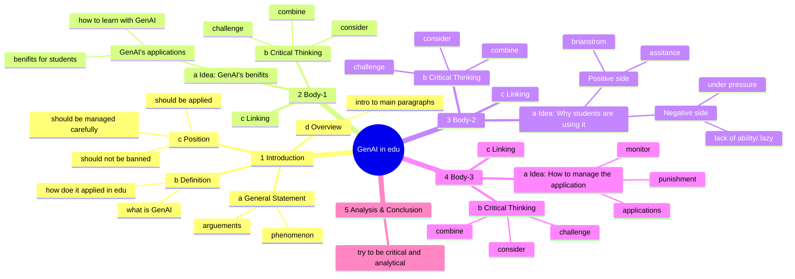

```mermaid
mindmap
  root((GenAI in edu))
    1 Introduction
        a General Statement
            phenomenon
            arguements
        b Definition
            what is GenAI
            how doe it applied in edu
        c Position
            should not be banned
            should be applied
            should be managed carefully
        d Overview
            intro to main paragraphs
    2 Body-1
        a Idea: GenAI's benifits
            GenAI's applications
                benifits for students
                how to learn with GenAI
        b Critical Thinking
            challenge
            consider
            combine
        c Linking
    3 Body-2
        a Idea: Why students are using it
            Positive side    
                assitance
                brianstrom
            Negative side
                under pressure
                lack of ability/ lazy
        b Critical Thinking
            challenge
            consider
            combine
        c Linking
    4 Body-3
        a Idea: How to manage the application
            applications
            monitor
            punishment
        b Critical Thinking
            challenge
            consider
            combine
        c Linking
    5 Analysis & Conclusion
        try to be critical and analytical
```